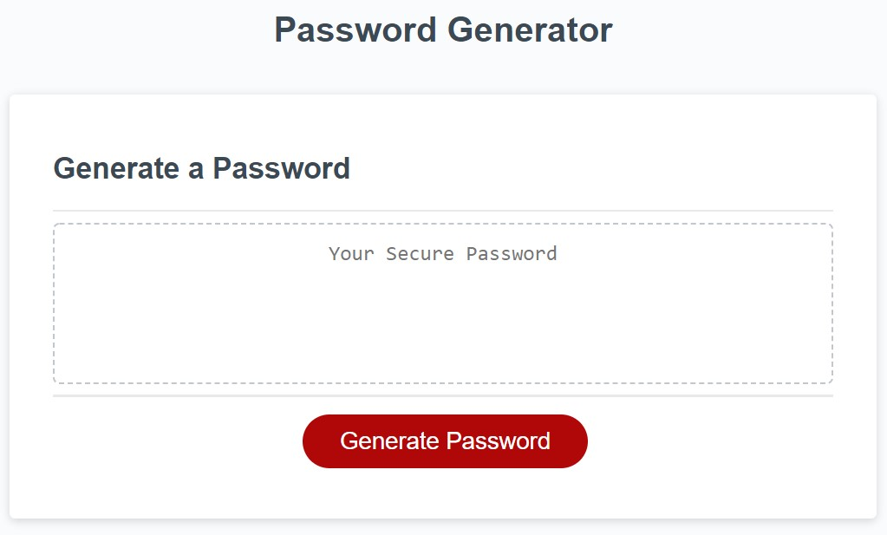

# Password Generator

## Purpose
This project was my first in-depth encounter with JavaScript. The website displays a window where the user can set preferences to create a 
unique and secure password. While creating this program, I learned arrays, if-statment parameters, event listeners, pushing information, and
much more!

## Built With
* HTML
* CSS
* JAVASCRIPT

## Website
https://magoofy.github.io/password-generator/

## Contribution

Me, Myself, and I - Afi Akau

